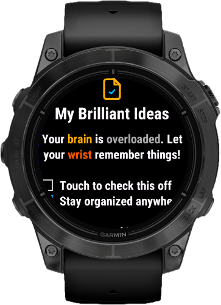
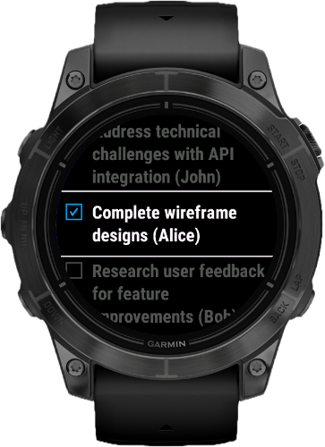
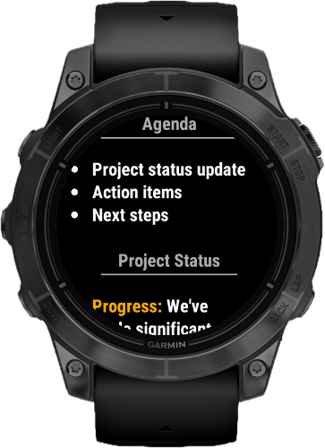
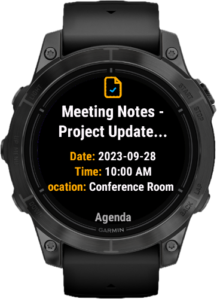
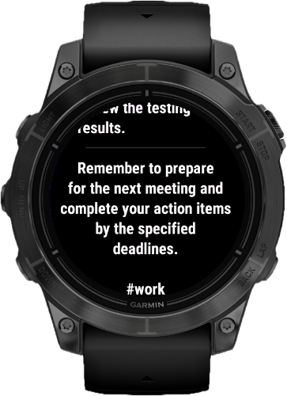
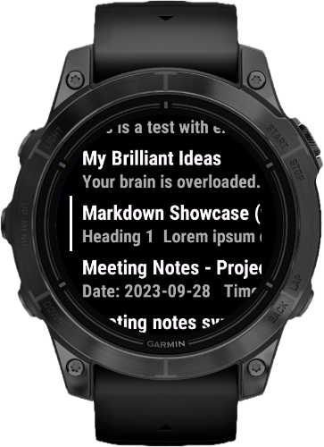
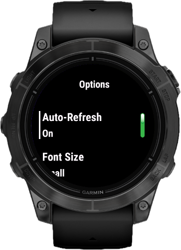

# WristDown

**Markdown notes on your Garmin watch** - Sync notes from your self-hosted [Flatnotes](https://github.com/dullage/flatnotes) server, view them with smooth scrolling, and toggle checkboxes right from your wrist.

<!-- Connect IQ Store Badge - Update URL after publishing -->

## Screenshots

## Features

- **Sync notes** from your self-hosted Flatnotes server with JWT authentication
- **Quick notes** - enter up to 3 notes directly in Garmin Connect settings (no server needed)
- **View markdown** with smooth pixel-based scrolling optimized for circular displays
- **Toggle checkboxes** - tap to check/uncheck tasks, changes saved on watch (optionally sync back to server)
- **Note filtering** - set a keyword filter to sync only specific notes (e.g., notes with "watch" in title)
- **Multiple font sizes** - Medium, Small, or Tiny to fit more content
- **Sort notes** by title or last modified date
- **Demo mode** - works out of the box with demo.flatnotes.io (no configuration needed)

## Supported Devices

Works on **50+ Garmin watches** including:
- Fenix 6/7/8 series
- Epix (Gen 2) / Epix Pro
- Forerunner 165/255/265/955/965/970
- Venu series
- ...and more

Requires **API Level 3.4.0+** and a phone with Garmin Connect Mobile.

## Quick Start

### Demo Mode (No Setup)

WristDown works out of the box! The default server URL points to demo.flatnotes.io, so you can:

1. Install WristDown from the Connect IQ Store
2. Open the app on your watch
3. Select **Sync** - sample notes will be downloaded from the Flatnotes demo server

To use your own server, simply change the server URL in Garmin Connect settings.

### Quick Notes (No Server)

You can enter up to 3 notes directly in the app settings - no server required:

1. Open **Garmin Connect** app on your phone
2. Go to **Devices** → Your watch → **Activities & Apps** → **Apps**
3. Find **WristDown** → **Settings**
4. Enter your notes in the **Note 1**, **Note 2**, **Note 3** fields (supports markdown)
5. Open WristDown on your watch - your notes appear at the top of the list

Quick notes are stored only locally on the watch and appear before any synced notes.

### Use Your Own Server

1. Set up a [Flatnotes](https://github.com/dullage/flatnotes) server
2. In the Garmin Connect Mobile app, go to WristDown settings
3. Enter your server URL, username, and password
4. Open WristDown on your watch and select **Sync**

See the [setup guide](docs/setup.md) for detailed configuration including optional checkbox sync-back.

## Server Requirements

WristDown connects to [Flatnotes](https://github.com/dullage/flatnotes), a self-hosted note-taking app. You'll need:

- A running Flatnotes instance accessible over HTTPS
- (Optional) A reverse proxy configured to rewrite PUT→PATCH for checkbox sync-back

See the [detailed setup guide](docs/setup.md) for configuration instructions.

## Markdown Support

WristDown renders common markdown syntax using colors (Garmin watches don't support bold/italic fonts):

| Syntax | Display |
|--------|---------|
| `**bold**` | Yellow text |
| `*italic*` | Light gray text |
| `# ## ###` | Headers with underline |
| `` `code` `` | Cyan text |
| `~~strike~~` | Dark gray text |
| `[ ]` `[x]` | Interactive checkboxes |
| `- item` | Bullet lists |
| `---` | Horizontal line |

See the [full markdown reference](docs/markdown.md) for details.

## PIN Protection

Protect individual notes with a 3-5 digit PIN configured in Garmin Connect app settings (Security → App PIN).

**Accessing note options to toggle protection:**
- **Touchscreen:** Swipe left while viewing a note
- **Button watches:** Hold MENU button (UP on Fenix/Forerunner) while viewing a note

Select "Protect with PIN" or "Remove Protection" from the menu.

## Disabling Server Sync

To use only Quick Notes without server sync, clear the Flatnotes URL in Garmin Connect app settings. On the next sync, previously synced server notes will be deleted and only your manual Quick Notes will remain.

Useful if you tried the demo server and now want to use only Quick Notes.

## Performance

Notes are pre-rendered when downloaded. After that, notes of any size open and scroll instantly with no lag. The app supports longer notes (tested with ~5 A4-page texts), though initial processing takes longer for large notes.

## Languages

**App interface:** Available in English.

**Note content:** Latin-based languages (English, French, German, Spanish, etc.) display correctly. Arabic and RTL languages are not supported. CJK languages have not been tested.

## Links

- [Setup Guide](docs/setup.md) - Server configuration instructions
- [Markdown Reference](docs/markdown.md) - Supported syntax
- [Flatnotes](https://github.com/dullage/flatnotes) - The note server WristDown connects to
- [Connect IQ Store](https://apps.garmin.com/en-US/apps/7d7054d3-0907-4f3a-a39b-c135830bd6ba)

## Feedback

Found a bug or have a feature request? Open an issue in this repository.
